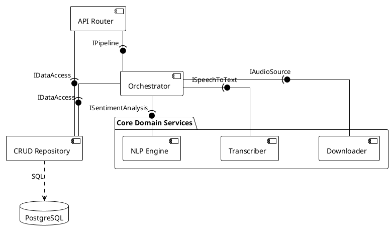
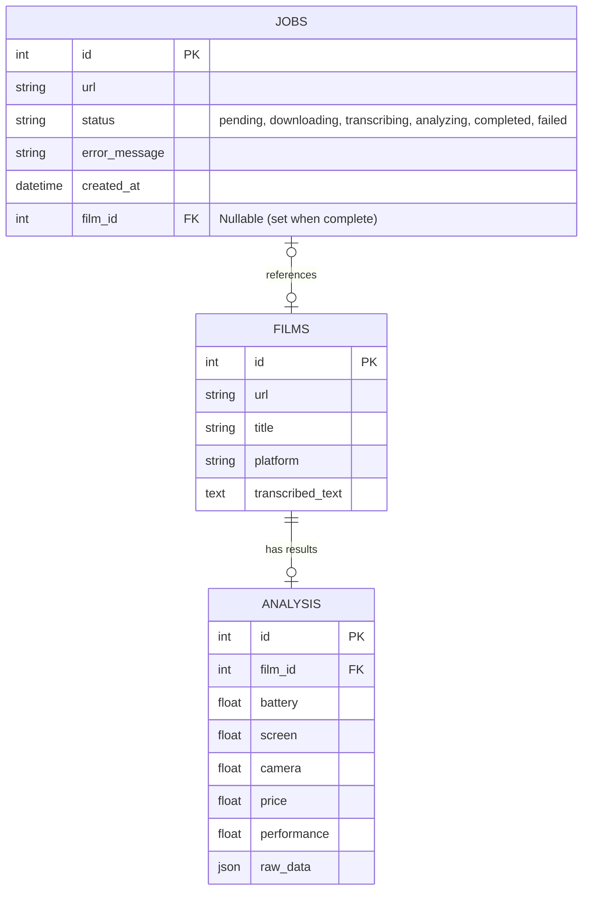
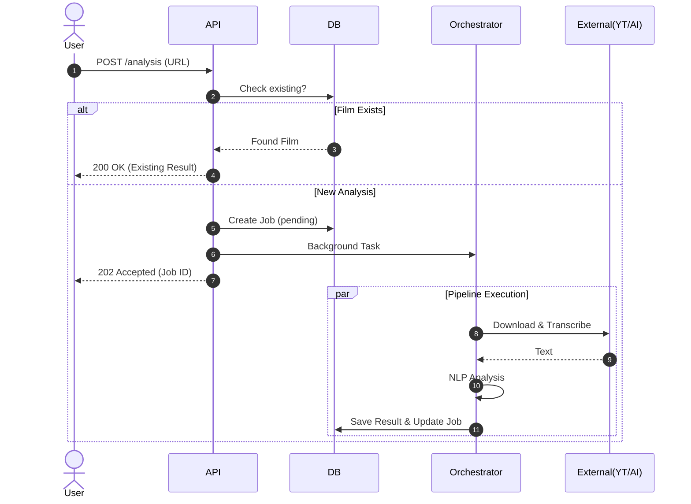

# Diagramy Architektury Systemu Video-Sent

## 1. Diagram Komponentów (Backend - PlantUML)

Diagram komponentów w notacji UML (składnia PlantUML).

## 2. Diagram Bazy Danych (ERD)

Model danych zaimplementowany w SQLAlchemy.

## 3. Diagram Sekwencji (Pipeline Analizy)

Przepływ sterowania dla funkcji `run_full_pipeline`.

